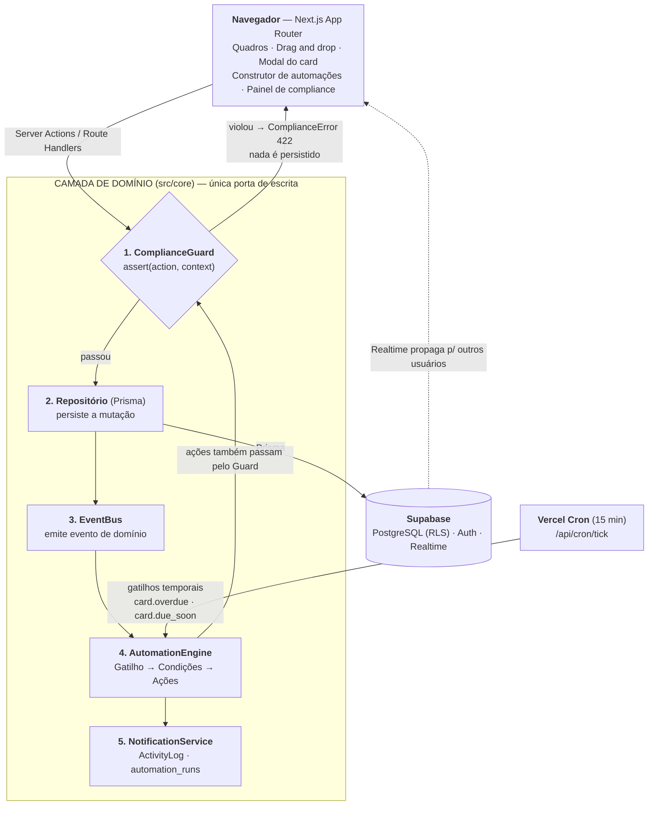

# Polímatas — Gestão de Vendas e Projetos

Sistema web para centralizar o funil comercial e a execução de projetos da Polímatas em uma única ferramenta, no estilo Trello, eliminando o controle disperso em planilhas, WhatsApp e anotações soltas.

Projeto desenvolvido para o **Hackathon Polímatas**.

📖 **[Backlog do produto →](https://bigkaio.github.io/polimatas-gestao-projetos/)** — visão, escopo, arquitetura, épicos e histórias de usuário, plano de sprints e roteiro da demo.

## Contexto

A Polímatas é uma empresa de tecnologia que hoje controla projetos e vendas de forma dispersa. Conforme o volume de clientes cresce, isso gera retrabalho: venda fechada que demora a virar projeto, tarefa sem responsável, prazo perdido e nenhuma visibilidade do andamento.

Este sistema conecta o comercial à execução em dois quadros integrados.

## O que o sistema faz

**Pipeline de Vendas** — oportunidades comerciais avançam pelas etapas Lead → Qualificação → Proposta → Negociação → Fechado/Perdido. É apenas o controle do funil, não uma plataforma de atendimento.

**Pipeline de Projetos** — quadro kanban de execução (Backlog → Em andamento → Revisão → Concluído), com cards, tarefas, responsáveis e prazos.

**Integração automática** — sempre que uma venda é marcada como *Fechada*, o sistema gera automaticamente um card de projeto, herdando os dados do cliente e da negociação. Esse é o fluxo central do produto: criar oportunidade → mover até *Fechada* → ver o card nascer no pipeline de projetos.

## Funcionalidades

- Interface tipo Trello: quadros, listas, cards e drag and drop
- Cadastro e movimentação de oportunidades e projetos
- Cards com responsável, descrição, prazo e checklist de tarefas
- **Automações personalizáveis**, criadas pelo próprio usuário sem programar (ex.: "quando o card entrar em Revisão, notificar o responsável"; "quando a tarefa passar do prazo, mover para Atrasados")
- **Compliance**: regras que o sistema impõe e bloqueiam ações fora do padrão (ex.: nenhuma tarefa pode ser criada sem deadline; nenhum projeto pode ir para Concluído com tarefas abertas)

## Stack técnica

| Camada | Tecnologia | Por quê |
|---|---|---|
| Frontend / fullstack | Next.js | App Router + API routes no mesmo projeto, deploy direto no Vercel a cada push |
| Hospedagem | Vercel | Plano gratuito, deploy automático via GitHub |
| Banco de dados | Supabase (Postgres) | Plano gratuito, autenticação e banco relacional prontos, setup rápido |

> A stack é livre por definição do desafio; esta é a decisão adotada pelo time por ser o caminho mais curto até um sistema no ar (push no GitHub e o deploy sobe sozinho).

## Arquitetura

Toda escrita passa por uma única porta na camada de domínio. O `ComplianceGuard` avalia as regras **antes** de qualquer persistência: se uma regra bloqueante é violada, nada é gravado e a interface reverte a ação. Só depois de persistir é que o `EventBus` emite o evento que alimenta o motor de automações.



O laço de volta do `AutomationEngine` para o `ComplianceGuard` é deliberado: **uma automação não pode furar uma regra de compliance**. Quando isso acontece, a execução é registrada como `blocked_by_compliance` e fica visível no histórico do card.

Detalhamento completo — modelo de dados, motor de automações, motor de compliance e segurança — em **[Arquitetura](https://bigkaio.github.io/polimatas-gestao-projetos/arquitetura/)**.

## Como rodar localmente

Pré-requisitos: Node.js 18+ e Docker (para o Postgres local — em produção o banco é o Postgres do Supabase, mesmo dialeto e mesmas migrações).

```bash
# clonar o repositório
git clone https://github.com/bigkaio/polimatas-gestao-projetos.git
cd polimatas-gestao-projetos

# subir o Postgres local
docker run -d --name polimatas-pg -e POSTGRES_PASSWORD=polimatas \
  -e POSTGRES_DB=polimatas -p 5432:5432 postgres:16-alpine

# instalar dependências e configurar o ambiente
npm install
cp .env.example .env   # os valores padrão já apontam para o Postgres do Docker

# migrar o banco e popular os dados de demonstração (idempotente)
npm run db:migrate
npm run db:seed

# subir o servidor
npm run dev
```

A aplicação fica em `http://localhost:3000`. Os testes dos motores e do fluxo venda → projeto rodam com `npm test` (exigem o banco migrado e o seed executado).

Para disparar os gatilhos temporais manualmente (em produção o Vercel Cron chama a cada 15 min):

```bash
curl -H "Authorization: Bearer dev-cron-secret" http://localhost:3000/api/cron/tick
```

## Credenciais de teste

Um usuário por papel, senha `polimatas123` para todos:

| Papel | E-mail | O que pode fazer |
|---|---|---|
| Admin | `admin@polimatas.dev` | Tudo, inclusive regras de compliance |
| Gestor | `gestor@polimatas.dev` | Quadros, projetos e automações |
| Vendas | `vendas@polimatas.dev` | Criar e mover oportunidades |
| Executor | `executor@polimatas.dev` | Ver quadros e concluir tarefas dos seus cards |

## Deploy

- **Produção:** _(link será adicionado quando o deploy estiver publicado)_
- Passos: criar um projeto no [Supabase](https://supabase.com), importar o repositório no [Vercel](https://vercel.com) e configurar as variáveis `DATABASE_URL` (connection pooling), `DIRECT_URL` (conexão direta), `SESSION_SECRET` e `CRON_SECRET`. O `vercel.json` já agenda o cron de gatilhos temporais; as migrações rodam com `npx prisma migrate deploy` e o seed com `npm run db:seed`.

## Adaptações registradas

Duas trocas em relação ao backlog, impostas pelo ambiente de desenvolvimento (sem projeto Supabase disponível), ambas isoladas para reversão fácil:

- **Autenticação**: e-mail + senha com hash bcrypt e sessão JWT em cookie httpOnly, em vez de Supabase Auth. Todo o mecanismo vive em [`src/lib/auth.ts`](src/lib/auth.ts); a matriz de papéis continua aplicada na camada de domínio, que é onde o bloqueio real acontece.
- **Tempo real**: quadro e notificações atualizam por polling leve (10–15 s), em vez de Supabase Realtime.

## Documentação

- **[Backlog do produto](https://bigkaio.github.io/polimatas-gestao-projetos/)** — visão, escopo, personas, arquitetura, modelo de dados, épicos e histórias de usuário com critérios de aceite, plano de sprints, riscos e roteiro da demo. Publicado no GitHub Pages; fonte em [`docs/`](docs/).

## Decisões técnicas

As decisões de arquitetura estão registradas no [backlog](https://bigkaio.github.io/polimatas-gestao-projetos/stack/#41-decisoes-arquiteturais-registradas-adrs-resumidas) (ADR-01 a ADR-06). Em resumo:

- **Uma única tabela `cards`** com discriminador de tipo (`opportunity` \| `project`), para que os motores de automação e compliance operem sobre uma única abstração e qualquer regra funcione nos dois quadros.
- **Compliance aplicado no servidor**, na camada de domínio, com constraints de banco como segunda linha — o requisito é bloquear de fato, não avisar na interface.
- **Regras persistidas em JSONB** e interpretadas em runtime, o que torna as automações configuráveis pelo usuário em vez de fixas no código.
- **A integração venda → projeto é uma automação nativa** do próprio motor, não um `if` no código.

## Status do projeto

✅ Funcional — dois quadros com drag and drop, integração automática venda → projeto, motor de automações configurável pela interface (gatilho → condições → ações), motor de compliance bloqueante em três camadas (UI, servidor e trigger no Postgres), gatilhos temporais via cron, notificações, histórico auditável e seed de demonstração. Motores e fluxo central cobertos por 12 testes automatizados (`npm test`).

## Critérios de avaliação

| Critério | O que é avaliado |
|---|---|
| Funcionamento | O fluxo venda → projeto roda de ponta a ponta? |
| Automação | As regras são configuráveis pelo usuário ou estão fixas no código? |
| Compliance | As regras realmente bloqueiam, ou são só avisos? |
| Usabilidade | Alguém da Polímatas conseguiria usar sem treinamento? |
| Apresentação | Demo clara e objetiva |
