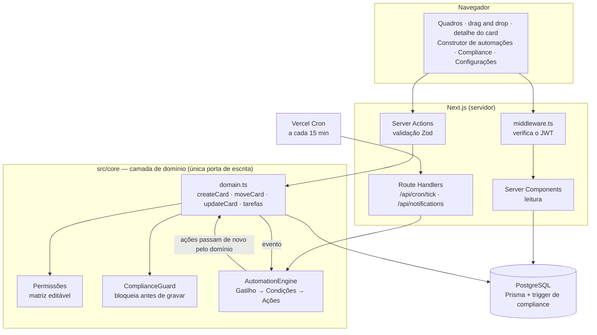
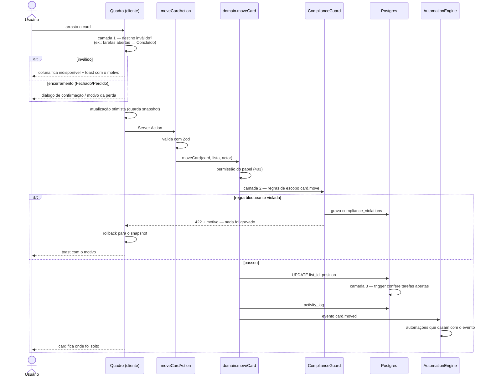
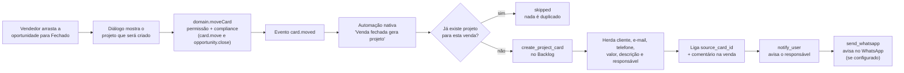
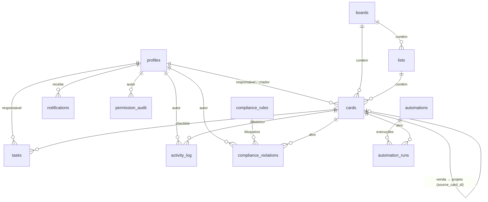

# Polímatas Flow — Stack e funcionamento do sistema

Este documento descreve **o que foi de fato implementado**: as tecnologias em uso,
por que cada uma foi escolhida e como o sistema funciona de ponta a ponta.

O backlog em [`docs/stack.md`](docs/stack.md) registra a stack **planejada** antes da
implementação. Algumas escolhas mudaram no caminho, e a seção
[Planejado × implementado](#3-planejado--implementado) explica cada diferença.

---

## Sumário

1. [O sistema em um parágrafo](#1-o-sistema-em-um-parágrafo)
2. [Stack e motivações](#2-stack-e-motivações)
3. [Planejado × implementado](#3-planejado--implementado)
4. [Arquitetura](#4-arquitetura)
5. [Funcionamento completo](#5-funcionamento-completo)
6. [Modelo de dados](#6-modelo-de-dados)
7. [Qualidade e testes](#7-qualidade-e-testes)
8. [Rodando localmente](#8-rodando-localmente)
9. [Limitações conhecidas](#9-limitações-conhecidas)

---

## 1. O sistema em um parágrafo

O Polímatas Flow liga o funil comercial à execução dos projetos. São dois quadros no
estilo Trello: o **Pipeline de Vendas** (Lead → Qualificação → Proposta → Negociação →
Fechado/Perdido) e o **Pipeline de Projetos** (Backlog → Em andamento → Revisão →
Concluído, mais Atrasados). Quando uma venda é arrastada para *Fechado*, o sistema cria
sozinho o card do projeto no Backlog, herdando cliente, valor, descrição e responsável.
Por cima dos quadros rodam dois motores configuráveis pela interface. O de
**automações** executa regras *Quando → Se → Então*. O de **compliance** recusa ações
fora do padrão antes de gravar qualquer coisa. Tudo fica auditado.

---

## 2. Stack e motivações

### Visão geral

| Camada | Tecnologia | Versão |
|---|---|---|
| Framework fullstack | Next.js (App Router, Server Actions) | 14.2 |
| Linguagem | TypeScript (`strict`) | 5.6 |
| Interface | React | 18.3 |
| Banco de dados | PostgreSQL | 16 |
| ORM e migrações | Prisma | 5.22 |
| Autenticação | Sessão JWT própria — `jose` + `bcryptjs` | 5.9 / 2.4 |
| Validação | Zod | 3.23 |
| Drag and drop | dnd-kit (`core`, `sortable`) | 6.1 / 8.0 |
| Estilo | Tailwind CSS + `clsx` | 3.4 / 2.1 |
| Testes | Vitest (integração contra Postgres real) | 2.1 |
| Hospedagem e agendamento | Vercel + Vercel Cron | — |
| Ambiente local | Docker (`postgres:16-alpine`) | — |
| Documentação do backlog | MkDocs Material + GitHub Pages | — |

### Next.js 14 com App Router

**O que faz aqui:** entrega a interface e o backend no mesmo projeto. As páginas são
Server Components que leem o banco direto. As escritas são **Server Actions**
(`src/app/actions/*`), e as rotas HTTP ficam restritas ao que precisa de URL: o cron e o
polling de notificações.

**Por quê:**

- **Um projeto e um deploy.** Não há API separada para versionar nem contrato
  cliente-servidor para manter sincronizado. Num prazo de hackathon, isso corta metade
  do trabalho de integração.
- **Server Actions eliminam a camada de controller.** O botão chama uma função
  TypeScript tipada. Não existe `fetch`, rota REST nem serialização manual.
- **Permissão verificada onde a página é montada.** Uma página como `/configuracoes`
  verifica a permissão no servidor e redireciona antes de enviar qualquer HTML.

**Trade-off aceito:** o código fica acoplado ao modelo de execução do Next. Para
reduzir esse acoplamento, **nenhuma regra de negócio vive nas actions**. Elas só
validam a entrada e chamam `src/core`, que não depende do Next.

### TypeScript em modo `strict`

**Por quê:** as regras de automação e de compliance são **dados JSON interpretados em
tempo de execução**. Um campo com nome errado não quebra na compilação, e sim em
produção, quando a regra dispara. A tipagem estrita, somada aos tipos que o Zod e o
Prisma geram, faz o compilador pegar essa classe de erro. Exemplos: `CONDITION_FIELDS`
e `TRIGGER_TYPES` são tuplas `as const`, e o construtor de regras só oferece o que o
motor sabe avaliar.

### PostgreSQL

**Por quê:**

- **O domínio é relacional.** Venda → projeto, card → tarefas, regra → violações. Com
  a ligação `source_card_id UNIQUE`, **o próprio banco garante que uma venda nunca gera
  dois projetos**.
- **JSONB para regras dinâmicas.** Gatilho, condições e ações de cada automação são
  colunas JSONB. É isso que torna as regras configuráveis pelo usuário sem mudar o
  schema.
- **Triggers como última linha de defesa.** Um trigger PL/pgSQL impede que um card com
  tarefas abertas entre numa lista *Concluído*, mesmo numa escrita que ignore a
  aplicação (ver [5.8](#58-motor-de-compliance)).
- **Mesmo dialeto em todo lugar.** Local em Docker, e em produção o Postgres do
  Supabase. As mesmas migrações rodam nos dois.

**Alternativa descartada:** MongoDB. A relação venda↔projeto e a garantia de unicidade
ficariam na aplicação, sem apoio do banco.

### Prisma

**O que faz aqui:** define o schema (`prisma/schema.prisma`), gera as migrações
versionadas (`prisma/migrations`) e gera o cliente tipado.

**Por quê:**

- **Migrações versionadas no Git.** `npm run db:migrate` reproduz o banco exato em
  qualquer máquina.
- **Tipos derivados do schema.** Mudar uma coluna quebra a compilação em todo lugar que
  a usa.
- **SQL cru quando precisa.** O trigger de compliance foi escrito à mão dentro da
  migração, e o Prisma não impede isso.

**Alternativas descartadas:** Drizzle (menor familiaridade do time) e SQL puro (sem
tipos).

### Autenticação própria com JWT (`jose` + `bcryptjs`)

**O que faz aqui:** o login confere a senha com `bcrypt` e grava um JWT HS256 assinado
num cookie `httpOnly`, `sameSite=lax`, com validade de 7 dias. O `middleware.ts`
verifica a assinatura em toda rota protegida.

**Por quê:**

- O plano previa Supabase Auth, mas **não havia projeto Supabase disponível** durante o
  desenvolvimento. Isolar a autenticação num único módulo (`src/lib/auth.ts`) mantém a
  troca barata: só ele conhece o mecanismo.
- **`jose`** roda no Edge Runtime, onde executa o middleware do Next, e as bibliotecas
  JWT baseadas em `crypto` do Node não rodam.
- **`bcryptjs`** é JavaScript puro, sem binário nativo para compilar no build da Vercel.

**Trade-off:** o papel do usuário viaja dentro do token (ver
[Limitações](#9-limitações-conhecidas)).

### Zod

**O que faz aqui:** valida toda entrada de Server Action. Também **define o formato das
próprias regras**: `triggerSchema`, `conditionGroupSchema`, `actionSchema` (uma
*discriminated union* de 8 ações) e `complianceRuleSchema`.

**Por quê:** um único schema serve para três coisas. Ele valida o que o construtor
envia, valida o JSON lido do banco antes de o motor executá-lo e gera os tipos
TypeScript. Uma regra malformada no banco é descartada com `safeParse` e **nunca
bloqueia nem dispara por acidente**.

### dnd-kit

**Por quê:**

- **Mantido ativamente.** O `react-beautiful-dnd`, referência histórica, foi
  descontinuado.
- **Acessível.** Tem sensor de teclado e anúncios para leitores de tela, e o quadro
  funciona sem mouse.
- **Funciona no celular.** Usa `TouchSensor` com atraso de 150 ms para não confundir
  arrastar com rolar a página.
- **Arrastar entre listas.** O movimento de lista para lista é nativo, que é
  exatamente o caso de um Kanban.

**Alternativa descartada:** a API nativa de drag and drop do HTML5, que é ruim em
dispositivos de toque e em acessibilidade.

### Tailwind CSS + `clsx`

**Por quê:** a identidade visual da Polímatas (`polimatasdesignguide.md`) foi aplicada
com classes utilitárias, sem design system externo. O `clsx` resolve as classes
condicionais, como switch ligado ou desligado e aba ativa.

**Trade-off:** os componentes (modal, toast, switch) foram escritos à mão em vez de vir
de uma biblioteca. Em troca, a interface fica com o visual exato do guia e sem
dependências de UI.

### Vitest

**Por quê:** é rápido e resolve os aliases do TypeScript (`@/`) sem configuração
extra. Os testes são de **integração contra o Postgres real**, e não com mocks: o
compliance depende de trigger no banco e de `UNIQUE`, e um mock esconderia justamente o
que precisa ser provado.

### Vercel + Vercel Cron

**Por quê:**

- **Deploy automático** a cada push, com preview por pull request.
- **O Vercel Cron resolve os gatilhos temporais** (*tarefa atrasada*, *prazo
  próximo*) sem worker dedicado nem fila paga. O `vercel.json` agenda
  `/api/cron/tick` a cada 15 minutos. Como os prazos são em dias, essa granularidade
  basta.

### Docker (desenvolvimento local)

**Por quê:** um único `docker run` sobe o mesmo Postgres 16 usado em produção, sem
instalar nada no sistema e sem conta em serviço externo.

### MkDocs Material + GitHub Pages

**Por quê:** o backlog do produto (`docs/`) é publicado como site navegável. Um
workflow do GitHub Actions republica o site a cada push que altere `docs/`.

---

## 3. Planejado × implementado

| Planejado (`docs/stack.md`) | Implementado | Motivo da mudança |
|---|---|---|
| Next.js 15 | **Next.js 14.2** | O projeto foi criado na linha 14 (`next@^14.2.5`), que já oferece App Router e Server Actions estáveis. A atualização para a 15 não foi feita. |
| Supabase Auth | **JWT próprio (`jose` + `bcryptjs`)** | Sem projeto Supabase disponível. O módulo `lib/auth.ts` isola a troca. |
| Supabase Realtime | **Polling a cada 10 s** (`/api/notifications`) | Sem Realtime. O quadro atualiza ao recarregar ou revalidar; o sino, por polling. |
| RLS no Postgres | **Camada de domínio + matriz de permissões** | Sem Supabase Auth não há `auth.uid()` para as políticas. A verificação foi para `src/core`. |
| shadcn/ui | **Tailwind puro** | Os componentes necessários (modal, toast, switch, abas) são poucos e foram escritos direto com a identidade visual do guia. |
| TanStack Query | **`useState` otimista + Server Actions + `router.refresh()`** | O único ponto com atualização otimista e rollback é o drag and drop, resolvido com um *snapshot* local do estado do quadro. |
| Playwright (fluxo E2E) | **Vitest de integração contra o banco** | O fluxo venda → projeto é coberto na camada de domínio, sem navegador. Não há teste de interface. |
| Matriz de permissões fixa | **Matriz editável pelo admin** | Adicionada depois: tela `/configuracoes` com auditoria. |

---

## 4. Arquitetura

### 4.1 Camadas



**A regra que sustenta o sistema:** nenhuma Server Action nem rota grava no banco
diretamente. Toda escrita de card ou tarefa passa por `src/core/domain.ts`. É isso que
garante que **permissão e compliance valem mesmo numa chamada direta**, sem passar pela
interface.

### 4.2 Estrutura de pastas

```
prisma/
  schema.prisma            modelo de dados
  migrations/              migrações versionadas (inclui o trigger de compliance)
  seed.ts                  usuários, quadros, regras e dados de demonstração
src/
  middleware.ts            bloqueia rotas sem sessão válida
  core/                    REGRAS DE NEGÓCIO — não depende do Next
    domain.ts              única porta de escrita (cards e tarefas)
    compliance.ts          ComplianceGuard
    engine.ts              AutomationEngine
    conditions.ts          avaliador de condições, compartilhado pelos dois motores
    rules.ts               schemas Zod de gatilhos, condições e ações
    context.ts             achata um card num contexto de avaliação
    permissions.ts         catálogo de capacidades (puro)
    permission-store.ts    leitura da matriz no banco, com cache
    events.ts · errors.ts  tipos de evento e erros de domínio (403/404/422)
  lib/
    auth.ts                login, cadastro e sessão JWT
    prisma.ts              cliente Prisma único
  app/
    actions/               Server Actions: validam e delegam ao core
    api/cron/tick          gatilhos temporais
    api/notifications      polling do sino
    (app)/…                páginas autenticadas
    page.tsx · login · cadastro   páginas públicas
  components/              componentes de interface
tests/                     integração contra o Postgres real
docs/                      backlog do produto (site MkDocs)
```

---

## 5. Funcionamento completo

### 5.1 Acesso: landing, contas e login

1. `/` é a **landing pública**, que apresenta o produto.
2. Uma conta nasce de uma de duas formas (ver [5.2](#52-cadastro-de-membros-da-equipe)):
   o **admin cadastra o membro** já com o papel certo, ou a própria pessoa se cadastra em
   `/cadastro` e entra como **Executor** (`member`).
3. Em `/login`, `login()` busca o perfil pelo e-mail, compara a senha com `bcrypt` e
   grava o cookie `polimatas_session` com `{ userId, role, name, email,
   mustChangePassword }` assinado.
4. O `middleware.ts` roda antes de cada requisição. Rotas públicas (`/`, `/login`,
   `/cadastro`, `/api/cron`) passam direto. Nas demais, um token ausente ou inválido
   redireciona para `/login`, e uma sessão com senha temporária é presa em
   `/definir-senha`.
5. O usuário cai em `/inicio`, o **painel** (ver [5.13](#513-painel-de-vendas-e-projetos)).

O seed cria um usuário por papel, todos com a senha `polimatas123`:
`admin@`, `gestor@`, `vendas@` e `executor@polimatas.dev`.

### 5.2 Cadastro de membros da equipe

O sistema não envia e-mail, então o cadastro funciona com **senha temporária**:

1. Em **Configurações → Usuários → Adicionar membro**, quem tem `users.manage` informa
   nome, e-mail e papel.
2. O servidor gera uma senha temporária de 12 caracteres, sem os que se confundem
   (`0/O`, `1/l/I`). Grava **só o hash** e marca `must_change_password`.
3. A senha aparece **uma única vez**, com o botão *Copiar mensagem de acesso*, para o
   admin repassar à pessoa. Não fica recuperável depois.
4. No primeiro login, a pessoa é levada a `/definir-senha` e **nenhuma outra página ou
   ação abre** até ela definir a própria senha. A trava vale no middleware e também em
   `requireSession()`, porque uma Server Action pode ser chamada por POST em qualquer
   caminho.
5. Ao salvar, a trava sai do banco, a sessão é reemitida e a senha temporária deixa de
   funcionar.

Enquanto a pessoa não fizer o primeiro acesso, a lista de usuários mostra o selo
*aguardando primeiro acesso*. Cada cadastro fica em `permission_audit`. E-mail repetido
é recusado.

### 5.3 Funções e permissões por pessoa

Existem quatro funções: **Vendedor** (`sales`), **Executor** (`member`), **Gestor**
(`manager`) e **Administrador** (`admin`). Elas **não mandam nas permissões** — servem
de **modelo**. Quem manda é a pessoa: o admin liga e desliga cada uma das onze
**capacidades** para cada usuário, e a tabela abaixo é o padrão de cada função:

| Capacidade | Vendedor | Executor | Gestor | Admin |
|---|:--:|:--:|:--:|:--:|
| `board.sales.mutate` — criar/mover oportunidades | ✅ | ❌ | ✅ | ✅ |
| `board.projects.mutate` — criar/mover projetos | ❌ | ❌ | ✅ | ✅ |
| `card.edit.own` — editar card em que é responsável | ✅ | ✅ | ✅ | ✅ |
| `card.edit.any` — editar card de outra pessoa | ✅ | ✅ | ✅ | ✅ |
| `card.delete` — excluir cards (com tarefas, comentários e histórico) | ❌ | ❌ | ✅ | ✅ |
| `card.comment` — comentar nos cards | ✅ | ✅ | ✅ | ✅ |
| `lists.manage` — criar, renomear e excluir colunas | ❌ | ❌ | ✅ | ✅ |
| `task.manage` — criar/editar/remover tarefas | ✅ | ✅ | ✅ | ✅ |
| `task.complete` — concluir tarefas | ✅ | ✅ | ✅ | ✅ |
| `automations.manage` | ❌ | ❌ | ✅ | ✅ |
| `compliance.manage` | ❌ | ❌ | ❌ | ✅ |
| `users.manage` — acesso às Configurações | ❌ | ❌ | ❌ | ✅ |

A tabela mostra o **modelo de cada função**. Em **Configurações** (engrenagem no
cabeçalho) o admin abre uma pessoa e ajusta cada capacidade individualmente.

**Como a verificação funciona:**

- Os modelos ficam no código (`DEFAULT_MATRIX`). A tabela `user_permissions` guarda
  **só o que foi personalizado por pessoa**: sem linha, vale o modelo da função dela.
- `permission-store.ts` resolve `override ?? modelo da função` e guarda o resultado num
  cache por pessoa, de 10 s. Toda gravação invalida o cache daquela pessoa na hora.
- **A função é lida do banco**, não da sessão: trocar o papel de alguém passa a valer
  na hora, sem esperar o próximo login.
- As capacidades se combinam:
  - editar um card alheio exige `card.edit.any` **e** a capacidade de mexer no quadro
    daquele card;
  - mexer em tarefas exige `task.manage` **e** poder editar o card.
- **Não existe pessoa intocável.** Qualquer permissão pode ser retirada de qualquer
  um, inclusive de quem tem papel de administrador. No lugar disso há duas travas:
  ninguém altera as próprias permissões, e o sistema recusa tirar `users.manage` da
  última pessoa que a tem.

**Configurações (`/configuracoes`)** tem três abas:

| Aba | O que faz |
|---|---|
| Pessoas e permissões | Cadastra membros (ver 5.2), troca a função, abre cada pessoa para ligar ou desligar capacidade a capacidade, e **desativa, reativa ou exclui** (ver 5.4). O selo *personalizado* marca o que difere do modelo, e há "voltar ao padrão" por capacidade e por pessoa. |
| Histórico | Quem mudou o quê, de qual valor para qual, e quando (`permission_audit`). |

Guardas no servidor: ninguém altera o **próprio** papel, o **último administrador** não
pode ser rebaixado e toda escrita exige `users.manage`.

### 5.4 Tirar alguém do sistema

Quem sai da equipe é **desativado**, não apagado:

- perde o acesso na hora — `requireSession()` confere o estado a cada página e manda
  para `/login`; o token continua válido até expirar, então a checagem não pode
  depender só do login;
- não entra mais, nem com a senha certa;
- some dos seletores de responsável, no quadro, no card, nas automações e no compliance;
- **os cards, comentários, tarefas e o histórico continuam com o nome dela.**

Reativar devolve tudo. A pessoa desativada aparece na lista com o selo *inativo*.

**Excluir de vez** só aparece para quem não deixou rastro: sem card criado, sem card ou
tarefa sob responsabilidade e sem comentário. Não é escolha de gosto — o banco exige um
criador para cada card, e o comentário sumiria junto com o perfil, furando o histórico.
A tentativa de excluir alguém com vínculos é recusada com 409 e a lista do que está preso.

Guardas: ninguém desativa ou exclui a própria conta, e o sistema recusa tirar do ar a
última pessoa com `users.manage`.

### 5.5 Quadros, listas e cards

Os dois quadros compartilham **uma única tabela `cards`**, e o campo `type`
(`opportunity` ou `project`) distingue os dois. Com isso, os motores de automação e
compliance operam sobre **uma** abstração, e qualquer regra funciona nos dois quadros
sem código novo.

As listas de cada quadro têm uma `stage_key` estável (`lead`, `fechado`, `backlog`…) e,
quando relevante, uma **semântica** que os motores usam em vez do nome exibido:

| Semântica | Lista | Efeito |
|---|---|---|
| `won` | Fechado | Pede confirmação e dispara a criação do projeto. |
| `lost` | Perdido | Exige motivo da perda. |
| `done` | Concluído | Bloqueia se houver tarefa aberta. |
| `late` | Atrasados | Destino das automações de atraso. |

**As colunas são personalizáveis** por quem tem `lists.manage`, no botão *Personalizar
colunas* do quadro: criar, renomear, escolher a cor numa paleta de 8 tons, reordenar e
excluir. Três travas sustentam o resto do sistema:

- **`stage_key` não muda no rename.** O nome é só exibição; a chave é a identidade da
  coluna para automações e compliance, e é gerada uma vez na criação (a partir do nome,
  sem acento nem espaço, com sufixo numérico se repetir).
- **Coluna com semântica não é excluída.** *Fechado*, *Perdido*, *Concluído* e
  *Atrasados* podem ser renomeadas e recoloridas, nunca apagadas.
- **Excluir exige destino.** Havendo cards, o sistema pede para qual coluna movê-los;
  nenhum card é apagado junto. A movimentação é estrutural e não dispara automações de
  "card mudou de lista", que seriam ruído.

**A ordem dos cards** usa `position` fracionário. Ao soltar um card entre dois
vizinhos, a nova posição é a média das posições deles. **Mover um card grava uma única
linha**, sem reindexar a lista inteira.

**O card aberto** (`/board/[key]/card/[id]`) mostra dados do cliente, valor,
responsável, prazo, **checklist** de tarefas e **comentários**. Cards ligados por
venda → projeto exibem o link para a origem e para o destino.

Tudo no card é editável no lugar: clicar no título, no valor ou na descrição já salva ao
sair do campo. O **Status** é um seletor na lateral, que move o card sem precisar
arrastar — e passa pelo mesmo compliance do arrastar, inclusive pedindo o motivo antes
de mandar para *Perdido* e confirmando antes de *Fechado*.

**Comentários** ficam na tabela `comments`, fora do `activity_log`: o log é trilha
imutável, e o comentário pode ser corrigido. Cada pessoa edita e apaga os próprios, o
admin apaga qualquer um para moderar, a edição fica marcada como *editado*, e criar,
editar e remover deixam rastro em `activity_log`. Quem comenta é controlado pela
capacidade `card.comment`.

**Criar card** acontece no rodapé de cada lista, com título e cliente. O botão *Mais
campos* revela responsável, prazo, valor e descrição, para o card já nascer completo.
Listas terminais (*Fechado*, *Perdido*, *Concluído*) não recebem card novo: o card chega
nelas sendo movido, o que preserva o fluxo do funil.

### 5.6 Arrastar um card, passo a passo

O drag and drop aplica o bloqueio em **três camadas**:



1. **Interface:** `invalidReason()` espelha as regras nativas e deixa a coluna de
   destino indisponível **antes** do drop. Isso é experiência, não garantia.
2. **Servidor:** `ComplianceGuard` avalia todas as regras ativas do escopo. Se alguma
   `block` for violada, lança `ComplianceError` (422) e **nada é persistido**. A
   interface volta o card para o lugar original.
3. **Banco:** o trigger `trg_forbid_done_with_open_tasks` impede que um card com
   tarefas abertas entre numa lista `done`, mesmo numa escrita SQL direta.

### 5.7 A camada de domínio: o roteiro de toda mutação

Toda função de `domain.ts` (`createCard`, `updateCard`, `moveCard`, `createTask`,
`updateTask`, `toggleTask`, `deleteTask`) segue a mesma ordem:

| # | Etapa | Falha resulta em |
|---|---|---|
| 1 | Carrega o registro | `NotFoundError` → 404 |
| 2 | Verifica a **permissão** do papel na matriz | `PermissionError` → 403 |
| 3 | Monta o **contexto** do card (`context.ts`) e roda o **ComplianceGuard** | `ComplianceError` → 422 |
| 4 | **Persiste** com Prisma | erro de banco (inclusive o trigger) |
| 5 | Grava em **`activity_log`** (antes/depois) | — |
| 6 | Emite o **evento de domínio** para o AutomationEngine | falhas de automação não desfazem a mutação |

Os eventos emitidos são `card.created`, `card.moved`, `card.field_changed` (um por campo
alterado), `task.created` e `task.completed`.

`src/app/actions/result.ts` converte os erros de domínio em respostas com mensagem de
negócio, e a interface mostra essa mensagem num toast.

### 5.8 Motor de compliance

**O que é:** regras que o sistema **impõe**, e não apenas sugere. Cada regra tem
escopo, condição, mensagem e severidade (`block` impede a ação; `warn` registra e
avisa).

**Escopos** (momento em que a regra é avaliada): `task.create`, `task.update`,
`card.create`, `card.move`, `card.update` e `opportunity.close` (avaliado junto com
`card.move` quando o destino é *Fechado*).

**Regras que vêm no seed:**

| Regra | Escopo | Nativa |
|---|---|:--:|
| Toda tarefa precisa de deadline | `task.create`, `task.update` | ✅ |
| Projeto não vai para Concluído com tarefas abertas | `card.move` | ✅ |
| Projeto em Em andamento precisa de responsável | `card.move` | |
| Oportunidade não vai para Proposta sem valor | `card.move` | |
| Oportunidade Perdida exige motivo de perda | `card.move` | |
| Projeto precisa de prazo ao sair do Backlog | `card.move` | |

As regras **nativas** (do briefing) são imutáveis: nem o admin as edita ou desliga. As
demais podem ser editadas e desligadas por quem tem `compliance.manage`. Novas regras
são montadas num formulário visual na própria tela de Compliance, com os mesmos campos
e operadores das automações.

**Mensagens com contexto:** a mensagem aceita modelos como
`"Este projeto tem {{open_tasks}} tarefa(s) aberta(s)"`.

**Prova viva:** cada bloqueio vira uma linha em `compliance_violations`, e a tela
`/compliance` lista o que foi impedido, para quem e quando.

### 5.9 Motor de automações

**Estrutura de uma regra:** **Gatilho → Condições (E/OU) → Ações**, montada em telas,
sem digitar JSON.

**Gatilhos**

| Gatilho | Dispara quando | Filtros opcionais |
|---|---|---|
| `card.created` | um card é criado | quadro |
| `card.moved` | um card muda de lista | quadro, lista de destino |
| `card.field_changed` | um campo muda | quadro, campo |
| `task.created` | uma tarefa é adicionada | quadro |
| `task.completed` | uma tarefa é concluída | quadro |
| `card.due_soon` | *(temporal)* faltam N dias para o prazo | quadro, dias (padrão 2) |
| `card.overdue` | *(temporal)* o prazo do card passou | quadro |
| `task.overdue` | *(temporal)* o prazo de uma tarefa passou | quadro |

**Condições:** campo + operador + valor. Os operadores são `é`, `não é`, `contém`,
`maior que`, `menor que`, `está vazio` e `está preenchido`. Os campos disponíveis são
lista, tipo, título, responsável, prazo, valor, cliente, motivo de perda, tarefas
abertas, lista de origem/destino e dados da tarefa. **O mesmo avaliador
(`conditions.ts`) serve aos dois motores.**

**Ações**

| Ação | Efeito |
|---|---|
| `notify_user` | Notifica o responsável, o criador, um usuário fixo ou todos |
| `send_whatsapp` | Envia WhatsApp ao cliente do card, ao responsável, a quem criou o card, a alguém da equipe (WhatsApp do perfil, em Configurações) ou a um número fixo, via Evolution API (`src/lib/whatsapp.ts`) |
| `move_card` | Move o card para outra lista |
| `assign_user` | Define o responsável |
| `set_due_date` | Define o prazo (data fixa ou hoje + N dias) |
| `add_task` | Adiciona tarefa ao checklist |
| `add_comment` | Registra comentário no histórico |
| `create_project_card` | Cria o card de projeto herdando dados da venda |
| `set_field` | Altera um campo do card |

**Variáveis nas mensagens** — todo texto de ação (`notify_user`, `send_whatsapp`,
`add_comment`, `add_task`, `create_project_card`, `set_field`) aceita `{{variável}}`,
trocada pelo dado do card na execução (`renderTemplate`, em `conditions.ts`). O
catálogo está em `src/lib/template-vars.ts` e alimenta os três pontos da tela:
botões de inserção, pré-visualização com um card real e aviso de variável
inexistente — que, sem aviso, viraria texto vazio na mensagem.

| Variável | Vira |
|---|---|
| `{{card.title}}` | Título do card |
| `{{card.client_name}}` (ou `{{client_name}}`) | Nome do cliente |
| `{{card.amount_brl}}` | Valor formatado (R$ 65.000,00); `{{card.amount}}` traz o número cru |
| `{{card.assignee_name}}` | Nome do responsável; `{{card.assignee}}` é o id, usado nas condições |
| `{{card.due_date_br}}` | Prazo em 07/11/2026; `{{card.due_date}}` é ISO, comparável nas condições |
| `{{card.lead_source}}` | Origem do lead |
| `{{card.list}}`, `{{card.open_tasks}}`, `{{card.loss_reason}}` | Coluna, tarefas abertas, motivo da perda |
| `{{task.title}}`, `{{task.due_date_br}}`, `{{task.assignee_name}}` | Da tarefa que disparou a regra |

**Como uma automação executa:**

1. `dispatch(evento)` carrega as automações ativas e filtra as que casam com o gatilho.
2. Para cada uma, monta o contexto do card e avalia as condições. Se não casar, nada
   acontece.
3. Executa as ações **na ordem definida**. A falha de uma ação não impede as seguintes.
4. **Toda ação passa de novo pela camada de domínio**, e portanto pelo compliance.
   **Uma automação não fura uma regra de compliance**: se tentar, a execução é
   registrada como `blocked_by_compliance`.
5. O resultado vai para `automation_runs` com status `success`, `skipped`, `error` ou
   `blocked_by_compliance` e o detalhe de cada ação. Isso aparece em **Histórico de
   execuções**.

**Proteções:**

- **Profundidade máxima 3.** Uma ação que dispara um evento que dispara outra automação
  é interrompida no terceiro nível, o que evita laço infinito.
- **Idempotência** por `(automation_id, card_id, event_key)`. O mesmo atraso não
  dispara a mesma regra duas vezes no mesmo dia.
- **Modo Testar:** o botão *Testar* roda a regra contra um card real em modo
  **simulação** e descreve em português o que *faria*, sem gravar nada.
- **Automações nativas** não podem ser excluídas; o botão aparece desabilitado.

### 5.10 O fluxo central: venda fechada vira projeto

É uma **automação nativa**, e não um `if` escondido no código. Isso demonstra o motor
funcionando e deixa a regra ajustável.



1. A oportunidade entra em *Fechado* (semântica `won`). A interface pede confirmação
   antes de gravar.
2. O domínio verifica a permissão e roda o compliance para `card.move` e
   `opportunity.close`.
3. O evento `card.moved` casa com a automação nativa (quadro `sales`, destino
   `fechado`, tipo `opportunity`).
4. `create_project_card` confere se já existe projeto com
   `source_card_id = id da venda`. Se existir, registra `skipped` e para. **Tirar a
   venda de Fechado e devolver não cria um segundo projeto**, e o `UNIQUE` no banco
   garante isso mesmo sob concorrência.
5. O projeto nasce no **Backlog** com o título `"{{cliente}} — {{título da venda}}"`,
   herdando os dados. A criação também passa pelo domínio e pelo compliance.
6. Um comentário na venda aponta para o projeto, e o responsável recebe notificação.

### 5.11 Gatilhos temporais (cron)

Eventos como *prazo passou* não nascem de uma ação do usuário, então alguém precisa
procurá-los.

1. O **Vercel Cron** chama `GET /api/cron/tick` a cada 15 min com
   `Authorization: Bearer <CRON_SECRET>`. Sem o segredo, a resposta é 401.
2. O endpoint carrega as automações temporais ativas e busca:
   - `card.overdue`: cards com prazo antes de hoje, fora de listas terminais;
   - `card.due_soon`: cards com prazo exatamente em N dias;
   - `task.overdue`: tarefas não concluídas com prazo vencido.
3. Para cada ocorrência, executa a automação com
   `event_key = tipo:id:data-de-hoje`. A idempotência garante **um disparo por dia**
   por ocorrência, mesmo com o cron rodando 96 vezes.
4. Devolve `{ ok, fired, at }`.

**Exemplo que vem no seed:** *Tarefa atrasada vai para Atrasados*. Quando o prazo de
uma tarefa passa e o card não está em *Concluído*, a automação move o card para
*Atrasados* e notifica o responsável.

### 5.12 Notificações

- São criadas pela ação `notify_user` das automações e pela troca de papel nas
  Configurações.
- O **sino** consulta `/api/notifications` **a cada 10 segundos** e mostra as 30 mais
  recentes e o contador de não lidas.
- Clicar num aviso abre o card relacionado e o marca como lido. Há também *Marcar todas
  como lidas*.

### 5.13 Painel de vendas e projetos

`/inicio` é a primeira tela depois do login e também o item **Visão geral** do menu.
Aberto a todos os papéis, porque é leitura.

| Bloco | O que mostra |
|---|---|
| Números do topo | Em negociação · Fechado no mês · Taxa de conversão · Ticket médio |
| Funil de vendas | Barras com o valor parado em cada etapa; o total de oportunidades aparece ao passar o mouse |
| Fechado por mês | Área com os últimos 6 meses de vendas ganhas |
| Ganhas e perdidas | Barra empilhada com o desfecho das oportunidades encerradas |
| Tarefas do time | Concluídas × abertas |
| Projetos | Em execução · Concluídos · Atrasados · Vencem em 7 dias |
| Projetos por etapa | Barras por coluna do quadro |
| Situação dos prazos | No prazo · Vencem em 7 dias · Atrasados · Sem prazo |
| Carga por responsável | Projetos em execução por pessoa |

**Os gráficos são SVG escrito à mão**, sem biblioteca de charts: são formas simples
(barra, área, barra empilhada) e uma dependência a mais custaria peso no pacote sem
resolver nada que o SVG não resolva.

Decisões de leitura, seguindo o guia de visualização de dados:

- **A paleta foi validada por script** contra a superfície escura — faixa de
  luminosidade, croma e contraste ≥ 3:1. Séries únicas usam um tom só (ciano
  `#0891b2`); status usa verde `#059669`, âmbar `#d97706` e vermelho `#e11d48`.
- **Cor nunca aparece sozinha.** Todo segmento de status traz rótulo e valor ao lado.
- **Um eixo por gráfico.** Valor e contagem nunca dividem a mesma escala: o funil
  desenha valor e informa a contagem no tooltip.
- **Cada gráfico tem a tabela equivalente** atrás de "Ver os números", para leitor de
  tela e para quem precisa do número exato.

### 5.14 Auditoria

| Tabela | Registra | Onde aparece |
|---|---|---|
| `activity_log` | Toda mutação de card e tarefa, mais criação, edição e remoção de comentário, com antes/depois, autor e automação de origem | Sem tela própria — consultado no banco |
| `automation_runs` | Cada execução de automação, com o resultado de cada ação | Automações → Histórico de execuções |
| `compliance_violations` | Cada tentativa bloqueada ou avisada: regra, card, autor e ação tentada | Compliance |
| `permission_audit` | Cada mudança de permissão, de papel e cada cadastro de membro | Configurações → Histórico |

---

## 6. Modelo de dados



| Tabela | Campos principais |
|---|---|
| `profiles` | `id`, `name`, `email` (único), `role`, `password_hash`, `must_change_password`, `deactivated_at` |
| `boards` | `id`, `key` (`sales` \| `projects`), `name`, `type` |
| `lists` | `id`, `board_id`, `name`, `stage_key`, `position`, `is_terminal`, `semantics`, `color` |
| `cards` | `id`, `board_id`, `list_id`, `type`, `title`, `description`, `position` (float), `assignee_id`, `due_date`, `client_name`, `client_email`, `client_phone`, `amount`, `loss_reason`, `source_card_id` (**único**), `created_by`, `archived_at` |
| `tasks` | `id`, `card_id`, `title`, `done`, `due_date` (**NOT NULL**), `assignee_id`, `position`, `completed_at` |
| `automations` | `id`, `name`, `enabled`, `is_system`, `trigger` / `conditions` / `actions` (**JSONB**) |
| `automation_runs` | `id`, `automation_id`, `card_id`, `status`, `event_key`, `payload`, `error` — único em `(automation_id, card_id, event_key)` |
| `compliance_rules` | `id`, `key`, `name`, `scope`, `condition` (JSONB), `message`, `severity`, `enabled`, `is_system` |
| `compliance_violations` | `id`, `rule_id`, `card_id`, `actor_id`, `attempted_action` (JSONB) |
| `comments` | `id`, `card_id`, `author_id`, `text`, `created_at`, `edited_at` |
| `notifications` | `id`, `user_id`, `card_id`, `message`, `read_at` |
| `activity_log` | `id`, `card_id`, `actor_id`, `action`, `before` / `after` (JSONB) |
| `user_permissions` | `user_id`, `capability`, `allowed` — único em `(user_id, capability)` |
| `permission_audit` | `actor_id`, `kind`, `target`, `before`, `after` |

**Garantias no próprio banco:** `tasks.due_date NOT NULL`, `cards.source_card_id UNIQUE`
e o trigger `trg_forbid_done_with_open_tasks`.

---

## 7. Qualidade e testes

`npm test` roda **41 testes** contra o Postgres real (exigem banco migrado e seed):

| Arquivo | O que prova |
|---|---|
| `tests/conditions.test.ts` | Operadores básicos · combinação E/OU · grupo vazio sempre passa · modelos `{{campo}}` |
| `tests/motores.test.ts` | Tarefa sem deadline é recusada e **não existe no banco** · projeto com tarefa aberta não entra em Concluído · **o trigger bloqueia escrita SQL direta** · Perdido exige motivo · **venda fechada cria o projeto herdando os dados** · sair e voltar para Fechado **não duplica** · automação bloqueada vira `blocked_by_compliance` · matriz de papéis |
| `tests/colunas.test.ts` | Chave derivada do nome sem acento · rename preserva a chave · nome repetido ganha sufixo · coluna com função no fluxo não é excluída · excluir exige destino e os cards são movidos, não apagados · `lists.manage` barra e libera |
| `tests/comentarios.test.ts` | Qualquer papel comenta por padrão · texto vazio recusado · só o autor edita · o admin remove o de outra pessoa e um par não · o admin pode desligar `card.comment` |
| `tests/desativar-usuario.test.ts` | Ativa segue o modelo da função · desativada perde todas as capacidades · não entra nem com a senha certa · reativar devolve o acesso · o banco impede apagar quem criou card |
| `tests/cadastro-membro.test.ts` | Senha temporária legível e sem caracteres ambíguos · conta criada com o papel escolhido e a trava de troca · só o hash é gravado · e-mail repetido é recusado |
| `tests/permissoes.test.ts` | Padrão do briefing · override substitui o padrão · admin nunca perde capacidade · capacidade desconhecida é ignorada · ligar uma capacidade libera a ação no domínio · desligar `task.complete` recusa concluir tarefa |

Os testes chamam **a camada de domínio diretamente**, sem interface. Isso prova que as
regras valem mesmo numa chamada que contorne a tela.

Também rodam `npm run lint` (ESLint `next/core-web-vitals`) e `tsc --noEmit`.

---

## 8. Rodando localmente

Pré-requisitos: Node.js 18+ e Docker.

```bash
# Postgres
docker run -d --name polimatas-pg -e POSTGRES_PASSWORD=polimatas \
  -e POSTGRES_DB=polimatas -p 5432:5432 postgres:16-alpine

# dependências e ambiente
npm install
cp .env.example .env

# banco
npm run db:migrate
npm run db:seed

# aplicação em http://localhost:3000
npm run dev
```

| Variável | Uso |
|---|---|
| `DATABASE_URL` | Conexão do Prisma (em produção, com pooling) |
| `DIRECT_URL` | Conexão direta para migrações |
| `SESSION_SECRET` | Assinatura do JWT de sessão — **troque em produção** (com `NODE_ENV=production`, o valor de exemplo derruba o login e o cron de propósito) |
| `CRON_SECRET` | Protege `/api/cron/tick` |
| `ALLOW_SELF_SIGNUP` | `"true"` libera o auto-cadastro em `/cadastro`; desligado por padrão (a equipe entra pelo "Adicionar membro") |
| `EVOLUTION_API_URL`, `EVOLUTION_API_KEY`, `EVOLUTION_INSTANCE` | Evolution API (WhatsApp) usado pela ação "Enviar WhatsApp" das automações — opcionais; sem elas a ação é pulada |
| `WHATSAPP_NOTIFY_NUMBER` | Número (DDD + número) que o seed coloca no aviso de venda fechada — opcional |

**Disparar o cron manualmente** (localmente não há Vercel Cron):

```bash
curl -H "Authorization: Bearer $CRON_SECRET" http://localhost:3000/api/cron/tick
```

**Parar sem perder dados:** `docker stop polimatas-pg`, e depois
`docker start polimatas-pg`. O comando `docker rm` apaga o banco.

---

## 9. Limitações conhecidas

| Limitação | Impacto | Caminho de evolução |
|---|---|---|
| **Sem tempo real.** | Outro usuário só vê o card movido ao recarregar. O sino tem atraso de até 10 s. | Supabase Realtime ou Server-Sent Events. |
| **O cron só existe na Vercel.** | Localmente, as automações temporais não disparam sozinhas. | Chamar o endpoint manualmente (seção 8) ou agendar com `cron` do sistema. |
| **Não há rebalanceamento de `position`.** | Após milhares de reordenações no mesmo ponto, a precisão do float pode se esgotar. | Um job que redistribui as posições quando o intervalo fica pequeno. |
| **Cache de permissões por processo.** | Com várias instâncias, uma mudança de permissão leva até 10 s para chegar a todas. | Invalidar via banco (`LISTEN/NOTIFY`) ou dispensar o cache. |
